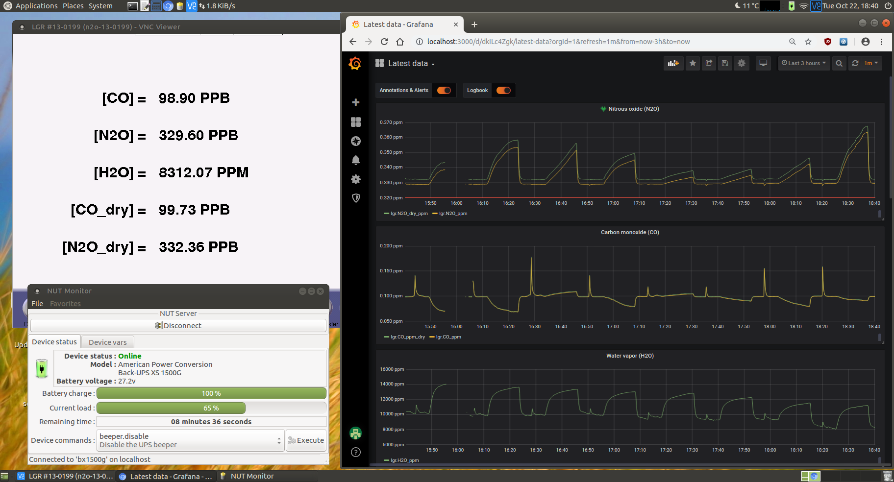
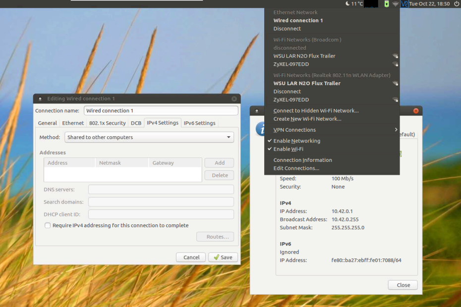
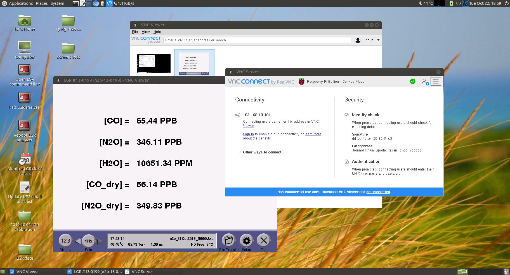
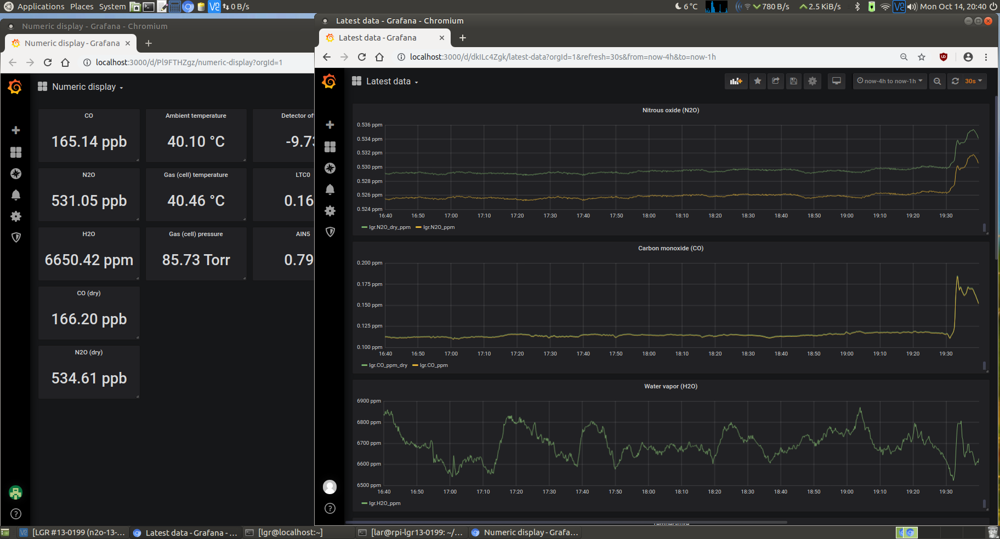
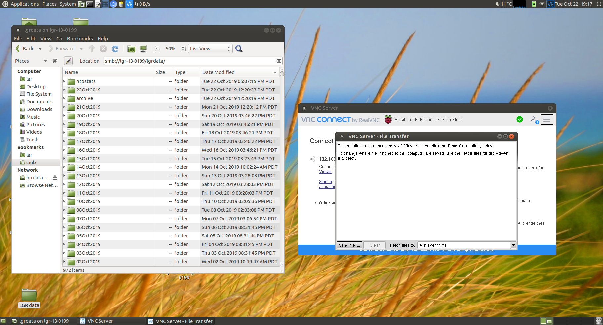
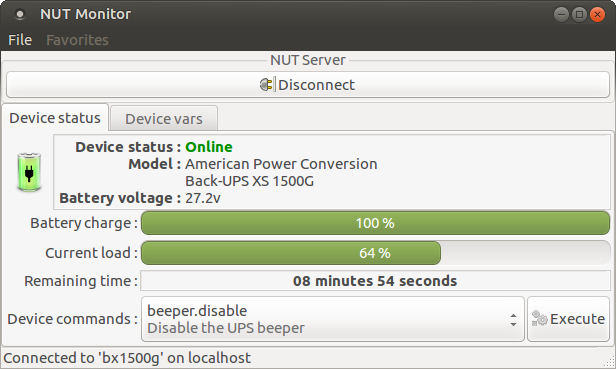

# LGR N2O/CO Analyzer Support Computer

Multipurpose support computer for a Los Gatos Research
[N2O/CO analyzer](http://www.lgrinc.com/analyzers/overview.php?prodid=20&type=gas)

## Features

### Internet Connection Sharing

Use the built-in wireless or a USB adapter to connect to the internet and share
with the analyzer.

* Easily edit and save multiple wireless networks using graphical interface
* Allow analyzer to synchronize clock with internet time (NTP) servers
* Protect analyzer by preventing direct network connections

### Remote Monitoring

Connect to the support computer desktop from a desktop, tablet or phone using
[VNC Viewer (RealVNC)](https://www.realvnc.com/download/viewer/). Once logged
in, launch VNC Viewer on the support computer to view the real-time display of
the analyzer.

> *The VNC service presents the local (HDMI) desktop on port 5900.*

### Data Visualization

Launch the web browser (Chromium) to view analyzer data using
[Grafana](https://grafana.com/). Data is obtained from the analyzer serial port
and stored permanently in [InfluxDB](https://github.com/influxdata/influxdb)
by the [lgr2influx](lgr2influx.md) service.

* choose a time interval for visualization (vs. fixed width built-in display)
* use a variety of data visualizations to explore measurements
* perform aggregations and transformations in real-time
* generate email alerts for user-defined data conditions

### Data Access

Browse the analyzer's data directory and copy files to the support computer for
backup or remote access. To retrieve files from the support computer, use the
[File Transfer](https://help.realvnc.com/hc/en-us/articles/360002250477)
feature of VNC Viewer (RealVNC) or connect to the support computer with an SFTP
browser such as [WinSCP](https://winscp.net/eng/index.php).

### Safe Analyzer Shutdown

Optionally monitor an uninterruptible power supply (UPS) and halt the analyzer
if battery runs low. Also send email alerts for certain status alerts.

### Vendor Support

Launch [Teamviewer](https://teamviewer.com) on the support computer to provide
Los Gatos Research support staff with remote access for troubleshooting.

### Desktop Shortcuts

Several useful shortcuts are included on the desktop. Some require the system
password or the analyzer VNC/service password.

* **Monitor LGR clock status**  
  *Opens a window with analyzer NTP status information.*
* **Update UPS email alert list**  
  *Edit system file containing the UPS alarm mailing list.*
* **Halt LGR analyzer**  
  *Send the analyzer safe shutdown command.*
* **Reboot LGR analyzer**  
  *Send the analyzer immediate reboot command.*
* **Open LGR command line**  
  *Access the analyzer command line. Useful for vendor support since
  <kbd>Alt</kbd>+<kbd>F2</kbd> is not available through VNC.*

### Watchdog

A hardware watchdog monitors system load and forcibly restarts the machine if
it somehow locks up. This could easily occur if, for example, too many browser
tabs are opened -- but the watchdog ensures the system restores itself and
resumes logging analyzer data.

## Learn More

* [Hardware Details](hardware.md)
* [Software Setup](setup.md)
* [`lgr2influx.service`](lgr2influx.md)
* [For Developers/To Do](notes.md)

## License

* Original software contributions are licensed under
  [the MIT License](https://opensource.org/licenses/MIT)
* Screenshots and documentation are licensed under
  [CC-BY-SA-4.0](https://creativecommons.org/licenses/by-sa/4.0/) (Creative
  Commons Attribution-ShareAlike 4.0 International)

